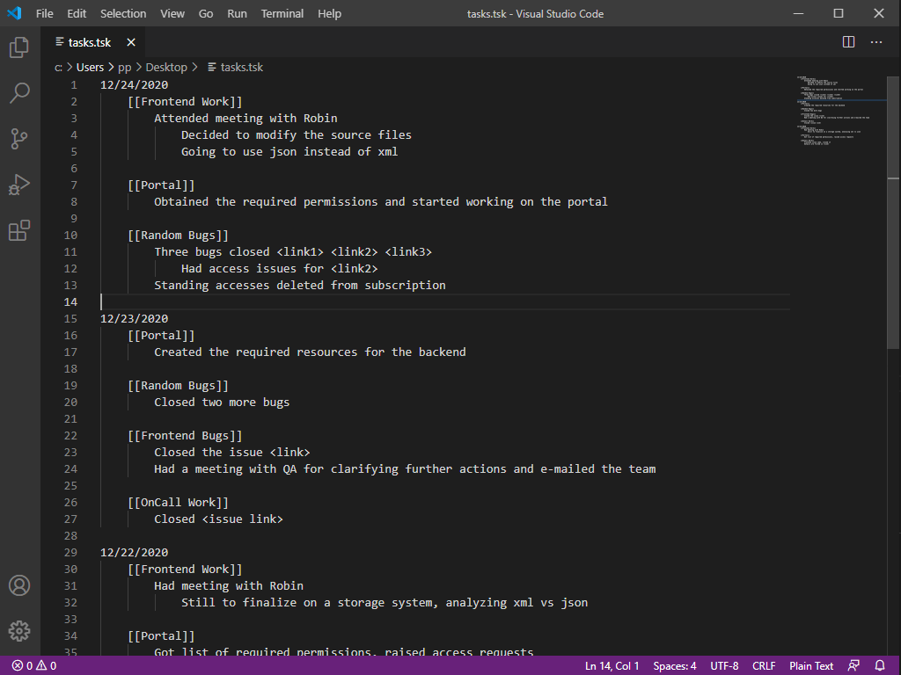
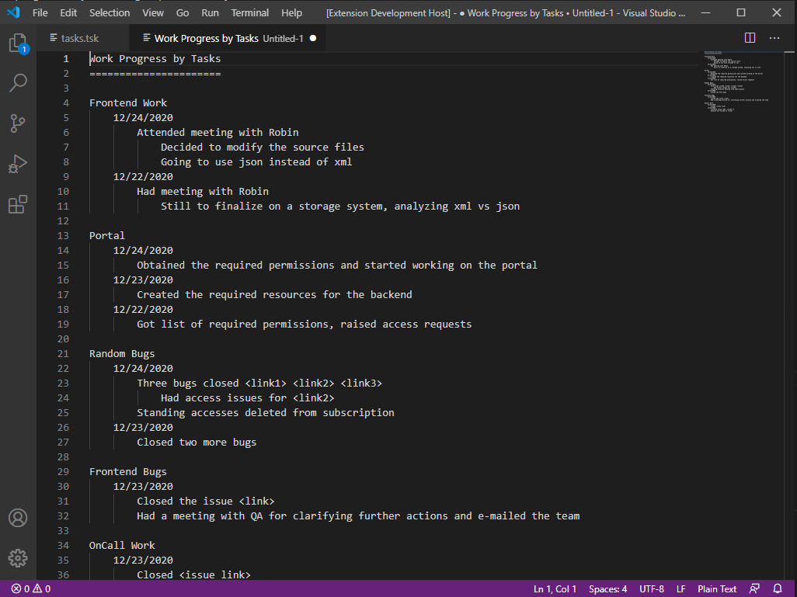
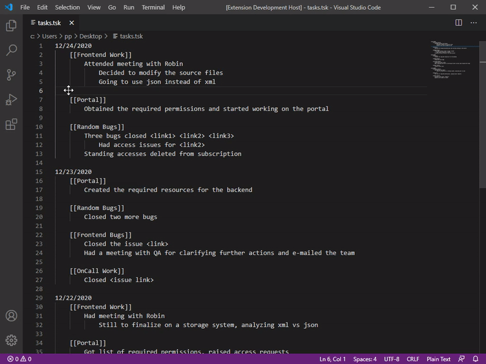

# PP Task Viewer

View tasks by Project, provided they're organized by date in a given format.

## Installation
> Ctrl + Shift + P

> ext install

> prasanthxyz.pptaskviewer

## Features

Processes a daily work log in an expected format (sample given below) and provides a task-based view for the data.

The idea is keeping a daily work log, updated every time some work is done.
All log/notes/updates are tagged to a particular task.
The extension basically processes this log, and shows daily updates/notes grouped by task.
The use case is where you need some interval, say last week's updats **for some particular task**.
That is, instead of a combined log of all tasks you can easily fitler out the logs of one task.

# Sample input file

# Sample output 

# Operation

## Requirements

Spaces/tabs as provided in the sample work-log is totally optional. I used it for a better visual hierarchy.

The log file date-format should be in the given format (00/00/0000), both MM/DD/YYYY and DD/MM/YYYY are supported.
Task name should be enclosed in double square brackets like this: [[TASK TAG]]

## Release Notes

### 1.0.0

Initial release of PP Task Viewer

### 1.0.1

Published, added installation instructions
